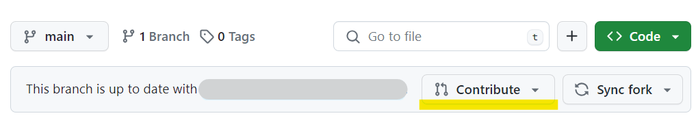

# Fork the repository

Fork this repository to your account:


# Setup the development environment

Cloned the forked repository :

- `git clone {forked_repository}`

Ensure you have the right node version:

- `v18.16.0`

Install dependencies:

- `npm install`

[Optional] Run storybook for development:

- `npm run storybook`

# Commit the changes

Run the tests:

- `npm test`

Format the files:

- `npm run format:write`

Commit the changes:

- By default, commitlint with `@commitlint/config-conventional` is applied. You can check the convention [here](https://github.com/conventional-changelog/commitlint/tree/master/@commitlint/config-conventional#type-enum). However, to summarize, it is as follows.

* **New feature**

  ```
  feat: <description>

  [optional body]
  ```

* **Bug Fixes**

  ```
  fix: <description>

  [optional body]
  ```

# Contribute

Contribute a pull request from the forked repository to the original repository:


