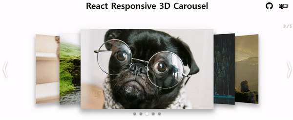
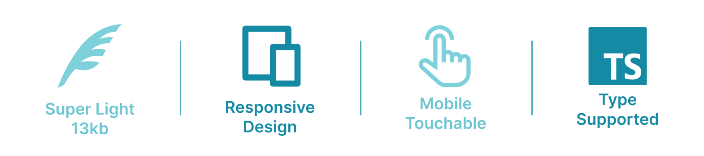
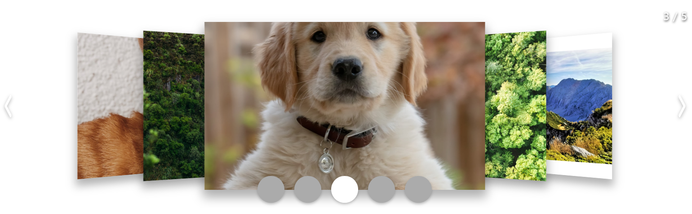

<h1>  React Responsive 3D Carousel</h1>

[](https://opensource.org/licenses/MIT)

The React Responsive 3D Carousel is a versatile component designed for React applications. It offers a responsive user interface that adapts seamlessly to different screen widths. Notably, it also includes support for recognizing swipe gestures on mobile devices.

Getting started with this package is straightforward. Explore the documentation for installation and usage instructions.

## Demo Page & Links

<div align="center" style="margin: 20px 0;">



</div>

- **[Demo Page](https://byongho96.github.io/react-responsive-3d-carousel)**
- [Github](https://github.com/Byongho96/react-responsive-3d-carousel)
- [npm](https://www.npmjs.com/package/react-responsive-3d-carousel)

## Key Features

<div align="center" style="margin: 20px 0;">



</div>

- Source map-excluded JavaScript file size is 12KB.
- Experience a responsive design that adapts to various screen sizes.
- Enable swipe gesture recognition to enhance mobile usability.
- Supports TypeScript and CommonJS.

## Installation

Install the package with the following command. **React18 should be pre-installed**.

```bash
npm install react-responsive-3d-carousel
```

## Usage

You can pass down <mark>any \<tag/></mark> you want

```jsx
import React from 'react'
import { Carousel } from 'react-responsive-3d-carousel'

export default App() {
  return (
    <Carousel>
      
      
      <video src="https://example-video-url" muted autoPlay loop />
      <iframe src="https://www.youtube.com/embed/example" title="YouTube video player" frameborder="0"/>
      <div>
        <p>Hello</p>
      </div>
    </Carousel>
  )
}
```

If the tag you want to display on the screen **does not go down directly**, you must add the following styling.

```jsx
import React from 'react'
import { Carousel } from 'react-responsive-3d-carousel'

export default App() {
  return (
    <Carousel>
      <a href="https://unsplash.com/">
        
      </a>
    </Carousel>
  )
}
```

## Props

| Name                    | Type                       | Default                  | Description                                            |
| ----------------------- | -------------------------- | ------------------------ | ------------------------------------------------------ |
| width                   | string                     | '500px'                  | Width of each carousel item (Accepts all CSS units)    |
| height                  | string                     | '300px'                  | Height of each carousel item (Accepts all CSS units)   |
| spread                  | 'wide', 'normal', 'narrow' | 'wide'                   | Adjusts the horizontal spacing between carousel items. |
| depth                   | number                     | 1                        | 3D depth of the carousel                               |
| autoPlay                | boolean                    | true                     | Automatically play slide animation                     |
| interval                | number                     | 3000                     | Slide transition time interval (ms)                    |
| transitionTime          | number                     | 500                      | Slide transition animation time (ms)                   |
| infiniteLoop            | boolean                    | true                     | Enable slide animation infinitely                      |
| startIndex              | number                     | 0                        | Index of the first carousel item to be centered        |
| pauseOnHover            | boolean                    | true                     | Stop slide animation when user hovers over carousel    |
| selectable              | boolean                    | true                     | Clicking a carousel item positions it to the center    |
| onClickCenteredItem     | (index: number) => void    | undefined                | Event fired when centered item is clicked              |
| isShadow                | boolean                    | true                     | Display shadows of carousel items                      |
| showStatus              | boolean                    | true                     | Display top right status text (e.g., `2/5`)            |
| statusSize              | 'small', 'medium', 'large' | 'small'                  | Size of the status text                                |
| statusColor             | string                     | 'rgb(255, 255, 255)'     | Color of the status text                               |
| isStatusShadow          | boolean                    | true                     | Display shadows for the status text                    |
| showArrows              | boolean                    | true                     | Display arrow buttons at both ends                     |
| arrowsWidth             | string                     | '48px'                   | Width of each arrow (Accepts all CSS units)            |
| arrowsHeight            | string                     | '83px'                   | Height of each arrow (Accepts all CSS units)           |
| arrowsDefaultColor      | string                     | 'rgb(255, 255, 255)'     | Color of arrows when not hovered                       |
| arrowsHoveredColor      | string                     | 'rgba(34, 34, 34, 0.53)' | Color of arrows when hovered                           |
| arrowsStrokeWidth       | number                     | 5                        | The stroke width of arrows path                        |
| isArrowsShadow          | boolean                    | true                     | Display shadows for arrows                             |
| showIndicators          | boolean                    | true                     | Display bottom indicators                              |
| indicatorsSize          | 'small', 'medium', 'large' | 'small'                  | Size of the indicators                                 |
| indicatorsActiveColor   | string                     | 'rgb(255, 255, 255)'     | Color of an activated indicator                        |
| indicatorsInactiveColor | string                     | 'rgba(67, 67, 67, 0.4)'  | Color of inactivated indicators                        |
| isIndicatorsShadow      | boolean                    | true                     | Display shadows for the indicators                     |
| onChange                | (index: number) => void    | undefined                | Callback when the centered index changed               |

## Customizing

If necessary, you can **override the CSS** with `!important`. The class name can be found in the browser's developer tools or [source code](https://github.com/Byongho96/react-responsive-3d-carousel/tree/main/src/components).

```css
.react-responsive-3d-carousel__indicators li {
  width: 36px !important;
  height: 36px !important;
}
```



## Contributing

Since this is my first npm package. Welcome to conributing.  
Here's [contributing guide](https://github.com/Byongho96/react-responsive-3d-carousel/blob/main/CONTRIBUTING.md) that contains details on how to set up a development environment.

## Issues

If you encounter an issue, please don't hesitate to let me know. Provide a detailed explanation along with any relevant images, and I'll do my best to make improvements. [Github Issues](https://github.com/Byongho96/react-responsive-3d-carousel/issues)
