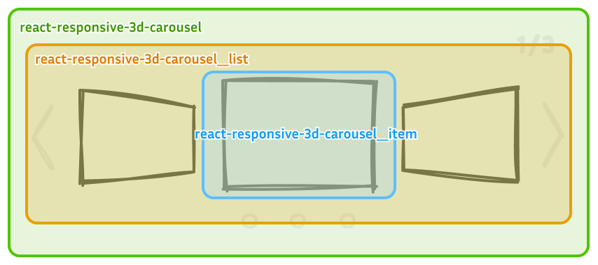
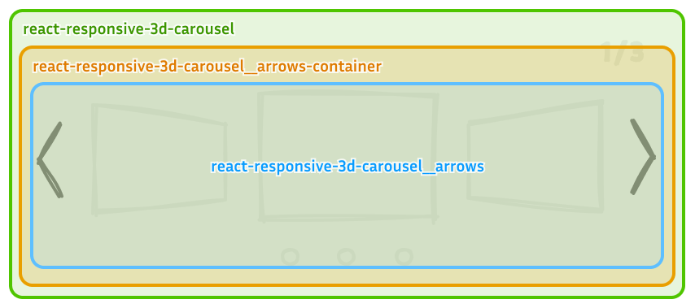

<h1> React Responsive 3D Carousel</h1>

  

A 3D carousel component for React, designed to create immersive, interactive experiences for your users.

## 🌟 Features

- 3D rotation effect for an eye-catching carousel experience
- Customizable speed, direction, and number of visible items
- Responsive design, adaptable to various screen sizes
- Easy to use with simple props and hooks

## 🔗 Important Links

- **[Documentation](https://byongho96.github.io/react-responsive-3d-carousel/)**
- [Layout Editor](https://byongho96.github.io/react-responsive-3d-carousel/layout-editor)
  <!-- - [Examples]() -->
- [Storybook](https://byongho96.github.io/react-responsive-3d-carousel/storybook/)
- [Github Repository](https://github.com/Byongho96/react-responsive-3d-carousel)

## 🚀 Getting Started

### Installation

Install the library via npm:

```bash
npm install react-responsive-3d-carousel
```

Or with Yarn:

```bash
yarn add react-responsive-3d-carousel
```

### Basic Usage

Here's a simple example of how to use the 3D Carousel in your React project:

```jsx
import React from 'react'
import { Carousel } from 'react-responsive-3d-carousel'
import 'react-responsive-3d-carousel/dist/styles.css'

const items = [
  ,
  <video src="video1.mp4" autoPlay />,
  <div>Custom Content 1</div>,
]

function App() {
  return (
    <div className="App">
      <Carousel
        items={items}
        startIndex={0}
        onChange={(currentIndex) => console.log(currentIndex)}
      />
    </div>
  )
}

export default App
```

> **Note:** Make sure to import the CSS file to properly style the Carousel. Otherwise import `react-responsive-3d-carousel/dist/index.esm.min.js` which includes the CSS.

</div>

## 📚 Documentation

Check out the [full documentation](https://byongho96.github.io/react-responsive-3d-carousel/).

### Carousel Props

| Prop Name           | Type                                                                              | Description                                                                                                                                                      | Default Value                          |
| ------------------- | --------------------------------------------------------------------------------- | ---------------------------------------------------------------------------------------------------------------------------------------------------------------- | -------------------------------------- |
| `children`          | `React.ReactNode`                                                                 | Optional children elements to be displayed in the 3D space besides the carousel item.                                                                            | `undefined`                            |
| `ariaLabel`         | `string`                                                                          | ARIA label for accessibility.                                                                                                                                    | `'3d carousel'`                        |
| `items`             | `JSX.Element[]`                                                                   | The array of items to be displayed in the carousel.                                                                                                              | `required`                             |
| `startIndex`        | `number`                                                                          | The index of the item to start at.                                                                                                                               | `0`                                    |
| `containerWidth`    | `string`                                                                          | Width of the carousel container.                                                                                                                                 | `'100%'`                               |
| `containerHeight`   | `string`                                                                          | Height of the carousel container. Container height must be fixed when `height` prop is responsive.                                                               | `'auto'`                               |
| `containerPadding`  | `string`                                                                          | Padding for the carousel container.                                                                                                                              | `'1rem'`                               |
| `width`             | `string \| number`                                                                | Width of each item; scales with container width if a number is provided.                                                                                         | `'400px'`                              |
| `height`            | `string \| number`                                                                | Height of each item; scales with container height if a number is provided.                                                                                       | `'300px'`                              |
| `aspectRatio`       | `'auto' \| number`                                                                | Aspect ratio of each item                                                                                                                                        | `'auto'`                               |
| `align`             | `'center' \| 'top' \| 'bottom'`                                                   | Alignment type for the items in the carousel.                                                                                                                    | `'center'`                             |
| `boxShadow`         | `string`                                                                          | [CSS Box shadow](https://developer.mozilla.org/en-US/docs/Web/CSS/box-shadow) style for the items.                                                               | `'0 0.1rem 0.5rem rgba(0, 0, 0, 0.5)'` |
| `perspective`       | `string \| number`                                                                | [CSS Perspective](https://developer.mozilla.org/en-US/docs/Web/CSS/perspective) distance for the 3D effect; scales with container width if a number is provided. | `1`                                    |
| `perspectiveOrigin` | `string`                                                                          | [CSS Perspective origin](https://developer.mozilla.org/en-US/docs/Web/CSS/perspective-origin) for the 3D effect.                                                 | `'center'`                             |
| `layout`            | `'default' \| CarouselLayoutInfo`                                                 | The layout prop supports two options: `'default'` for a standard layout, and `CarouselLayoutInfo` for full customization. (see table)                            | `'default'`                            |
| `defaultOption`     | `DefaultOption`                                                                   | Configuration for default layout, including numOfSlides, widthFactor, depthFactor, and angleFactor (see table below).                                            | `undefined`                            |
| `sizeDuration`      | `number`                                                                          | Duration for size transition.                                                                                                                                    | `1000`                                 |
| `sizeTimingFn`      | `string`                                                                          | [CSS Transition timing function](https://developer.mozilla.org/en-US/docs/Web/CSS/transition-timing-function) for width and height.                              | `'ease-in-out'`                        |
| `transformDuration` | `number`                                                                          | Duration for transform transition.                                                                                                                               | `1000`                                 |
| `transformTimingFn` | `string`                                                                          | [CSS Transition timing function](https://developer.mozilla.org/en-US/docs/Web/CSS/transition-timing-function) for transform transition.                          | `'ease-in-out'`                        |
| `focusOnSelect`     | `boolean`                                                                         | If true, the selected item is centered when clicked.                                                                                                             | `true`                                 |
| `pauseOnHover`      | `boolean`                                                                         | If true, pauses auto-play when hovered.                                                                                                                          | `true`                                 |
| `pauseOnTransition` | `'none' \| 'size' \| 'transform' \| 'both'`                                       | Determines when sliding is allowed based on the completion of transition animations.                                                                             | `'both'`                               |
| `onChange`          | `(index: number, item: JSX.Element) => void`                                      | Callback function triggered when the centered item changes.                                                                                                      | `undefined`                            |
| `onClickItem`       | `(e: MouseEvent, index: number, item: JSX.Element, isCurtIndex: boolean) => void` | Callback when an item is clicked, providing event, index, item, and if it’s the current item.                                                                    | `undefined`                            |
| `autoPlay`          | `boolean`                                                                         | Enables auto-play of the carousel.                                                                                                                               | `true`                                 |
| `interval`          | `number`                                                                          | Interval time (in ms) for auto-play.                                                                                                                             | `3000`                                 |
| `infiniteLoop`      | `boolean`                                                                         | Enables infinite loop of the carousel items.                                                                                                                     | `true`                                 |
| `autoFocus`         | `boolean`                                                                         | If true, the carousel container will automatically when it's loaded.                                                                                             | `true`                                 |
| `slideWithKeyboard` | `'none' \| 'vertical' \| 'horizontal' \| 'both'`                                  | Enables sliding with keyboard arrow keys.                                                                                                                        | `'both'`                               |
| `swipeable`         | `boolean`                                                                         | Enables swipe interaction for the carousel on touch devices.                                                                                                     | `true`                                 |
| `swipeDirection`    | `'horizontal' \| 'vertical'`                                                      | Direction of swipe allowed.                                                                                                                                      | `'horizontal'`                         |
| `onSwipeStart`      | `(event: TouchEvent) => void`                                                     | Callback function triggered when a swipe starts.                                                                                                                 | `undefined`                            |
| `onSwipeEnd`        | `(event: TouchEvent) => void`                                                     | Callback function triggered when a swipe ends.                                                                                                                   | `undefined`                            |
| `onSwipeMove`       | `(event: TouchEvent) => void`                                                     | Callback function triggered during a swipe move.                                                                                                                 | `undefined`                            |
| `showStatus`        | `boolean`                                                                         | If true, displays status for the carousel.                                                                                                                       | `true`                                 |
| `status`            | `StatusProps`                                                                     | Additional Status props (see table below).                                                                                                                       | `{}`                                   |
| `showArrows`        | `boolean`                                                                         | If true, displays arrows navigation buttons.                                                                                                                     | `true`                                 |
| `arrows`            | `ArrowsProps`                                                                     | Additional Arrows props (see table below).                                                                                                                       | `{}`                                   |
| `showIndicators`    | `boolean`                                                                         | If true, displays indicators for each item in the carousel.                                                                                                      | `true`                                 |
| `indicators`        | `IndicatorsProps`                                                                 | Additional Indicators props (see table below).                                                                                                                   | `{}`                                   |

### Default Option Props

These props are only effective when `layout` is set to `'default'`.

| Prop Name     | Type                   | Description                                                   | Default Value |
| ------------- | ---------------------- | ------------------------------------------------------------- | ------------- |
| `numOfSlides` | `'auto' \| 2 \|3 \| 5` | Number of slides to show, or 'auto' for automatic adjustment. | `'auto'`      |
| `widthFactor` | `number`               | Carousel spread factor for width.                             | `1`           |
| `depthFactor` | `number`               | Depth intensity for the carousel effect.                      | `1`           |
| `angleFactor` | `number`               | Rotation intensity for each item.                             | `1`           |

### Custom Layout (`CarouselLayoutInfo`)

Try using the [Custom Layout Editor](https://byongho96.github.io/react-responsive-3d-carousel/layout-editor) !

`CarouselLayoutInfo` lets you define custom layouts for carousel items, controlling each item’s size, position, and rotation relative to the selected item. Each `CarouselLayoutInfo` entry consists of multiple `LayoutInfo` objects applied to items based on their index.

The `default` layout uses the same structure. [See Example](https://github.com/Byongho96/react-responsive-3d-carousel/blob/main/src/constant/layout.ts).

#### LayoutInfo

By default, each carousel item is centered within the container.

```typescript
export type LayoutInfo = {
  width?: number | string // scales with container width if a number. When it's undefined or 'auto', the width prop is used.
  height?: number | string // scales with container height if a number. When it's undefined or 'auto', the height prop is used.
  translate: {
    x: number | string // scales with container width if a number
    y: number | string // scales with container height if a number
    z: number | string // scales with container width if a number
  }
  rotate: {
    x: number // in degrees
    y: number // in degrees
    z: number // in degrees
  }
  offset: {
    x: number | string // scales with item width if a number
    y: number | string // scales with item height if a number
    z: number | string // scales with item width if a number
  }
}
```

#### CarouselLayoutInfo

`CarouselLayoutInfo` defines the layout for each carousel item, including a `default-key` layout used when no specific layout is provided.

- 0: Represents the selected item
- Positive numbers: For upcoming items
- Negative numbers: For previous items

```typescript
export type CarouselLayoutInfo = {
  default: LayoutInfo
  [key: number]: LayoutInfo
}
```

### Arrows Props

Arrows props are sub-fields used under the `arrows` object prop in the `Carousel` component.

| Prop Name            | Type                      | Description                                                                                                                  | Default Value                           |
| -------------------- | ------------------------- | ---------------------------------------------------------------------------------------------------------------------------- | --------------------------------------- |
| `width`              | `string`                  | Width of the arrow buttons.                                                                                                  | `'3rem'`                                |
| `height`             | `string`                  | Height of the arrow buttons.                                                                                                 | `'5rem'`                                |
| `color`              | `string`                  | Color of the arrow buttons.                                                                                                  | `'#ffffff'`                             |
| `hoverColor`         | `string`                  | Color of the arrow buttons when hovered and active.                                                                          | `'#888888'`                             |
| `shadow`             | `string`                  | [CSS Drop shadow](https://developer.mozilla.org/en-US/docs/Web/CSS/filter-function/drop-shadow) style for the arrow buttons. | `'0 0.05rem 0.1rem rgba(0, 0, 0, 0.3)'` |
| `prevIcon`           | `JSX.Element`             | Custom icon for the previous arrow.                                                                                          | `undefined`                             |
| `nextIcon`           | `JSX.Element`             | Custom icon for the next arrow.                                                                                              | `undefined`                             |
| `nextArrowTranslate` | `[string, string]`        | Translation offset for the next arrow button. [X, Y]                                                                         | `['0px', '0px']`                        |
| `prevArrowTranslate` | `[string, string]`        | Translation offset for the previous arrow button. [X, Y]                                                                     | `['0px', '0px']`                        |
| `onClickNext`        | `(e: MouseEvent) => void` | Callback function triggered when the next arrow is clicked.                                                                  | `undefined`                             |
| `onClickPrev`        | `(e: MouseEvent) => void` | Callback function triggered when the previous arrow is clicked.                                                              | `undefined`                             |

### Indicators Props

Indicators props are sub-fields used under the `indicators` object prop in the `Carousel` component.

| Prop Name       | Type                                     | Description                                                                                                               | Default Value                           |
| --------------- | ---------------------------------------- | ------------------------------------------------------------------------------------------------------------------------- | --------------------------------------- |
| `width`         | `string`                                 | Width of each indicator.                                                                                                  | `'0.7rem'`                              |
| `height`        | `string`                                 | Height of each indicator.                                                                                                 | `'0.7rem'`                              |
| `color`         | `string`                                 | Color of the inactive indicators.                                                                                         | `'#ffffff'`                             |
| `activeColor`   | `string`                                 | Color of the indicator when active and hovered.                                                                           | `'#888888'`                             |
| `gap`           | `string`                                 | Gap between each indicator.                                                                                               | `'1.5rem'`                              |
| `shadow`        | `string`                                 | [CSS Drop shadow](https://developer.mozilla.org/en-US/docs/Web/CSS/filter-function/drop-shadow) style for the indicators. | `'0 0.05rem 0.1rem rgba(0, 0, 0, 0.5)'` |
| `translate`     | `[string, string]`                       | Translation offset for the indicators container. [X, Y]                                                                   | `['0px', '0px']`                        |
| `indicatorIcon` | `JSX.Element`                            | Custom icon for indicators.                                                                                               | `undefined`                             |
| `onClick`       | `(e: MouseEvent, index: number) => void` | Callback function triggered when an indicator is clicked.                                                                 | `undefined`                             |

### Status Props

Status props are sub-fields used under the `status` object prop in the `Carousel` component.

| Prop Name    | Type               | Description                                                                                                | Default Value                           |
| ------------ | ------------------ | ---------------------------------------------------------------------------------------------------------- | --------------------------------------- |
| `color`      | `string`           | Color of the status text.                                                                                  | `'#ffffff'`                             |
| `fontSize`   | `string`           | Font size of the status text.                                                                              | `'1rem'`                                |
| `fontWeight` | `string`           | Font weight of the status text.                                                                            | `'600'`                                 |
| `shadow`     | `string`           | [CSS Text shadow](https://developer.mozilla.org/en-US/docs/Web/CSS/text-shadow) style for the status text. | `'0 0.05rem 0.1rem rgba(0, 0, 0, 0.5)'` |
| `translate`  | `[string, string]` | Translation offset for the status container. [X, Y]                                                        | `['0px', '0px']`                        |

## 🗂️ Context API

The `CarouselContext` is a React context that provides access to the current index of the carousel. This makes it easy to integrate custom behaviors based on the carousel's current state.

```typescript
type DefaultContext = {
  curIndex: number
  setCurIndex: React.Dispatch<React.SetStateAction<number>>
  slideNext: () => void
  slidePrev: () => void
}
```

Use the `CarouselContext` within the `<Carousel />` component. For example, you can access it in any React component passed as the `items` or `children` prop.

```jsx
import React, { useContext } from 'react'
import { CarouselContext } from 'react-responsive-3d-carousel'

function CarouselItem() {
  const { curIndex, setCurIndex } = useContext(CarouselContext)

  return (
    <div>
      <p>Current Slide: {curIndex}</p>
      <button onClick={() => setCurIndex(0)}>Go to first slide</button>
    </div>
  )
}
```

## 🎨 Customization

- You can fully customize the carousel by overriding its default CSS styles.
- To prevent style conflicts, all class names are prefixed with `react-responsive-3d-carousel`. Refer to the images below for details on each class name.

### Carousel



### Arrows

- The `*-container` class positions the component with `position: absolute` and applies `pointer-events: none` to prevent interference with user interactions over carousel items.
- Access each arrow button using the `button` child selector.



### Status and Indicators

- The `*-container` classes position the components with `position: absolute` and applies `pointer-events: none` to prevent interference with user interactions over carousel items.
- Use the `p` child selector to style the status text.
- Use the `ul` and `li` child selectors to style indicators.


## 📝 License

This project is licensed under the MIT License - see the [LICENSE](https://github.com/Byongho96/react-responsive-3d-carousel/blob/main/LICENSE) file for details.

## 🤝 Contributing

Contributions, issues, and feature requests are welcome! Feel free to check the [CONTRIBUTING.md](https://github.com/Byongho96/react-responsive-3d-carousel/blob/main/CONTRIBUTING.md) if you want to contribute.

## ⭐️ Show Your Support

If you like this project, please give it a ⭐️ on [GitHub](https://github.com/Byongho96/react-responsive-3d-carousel)!
